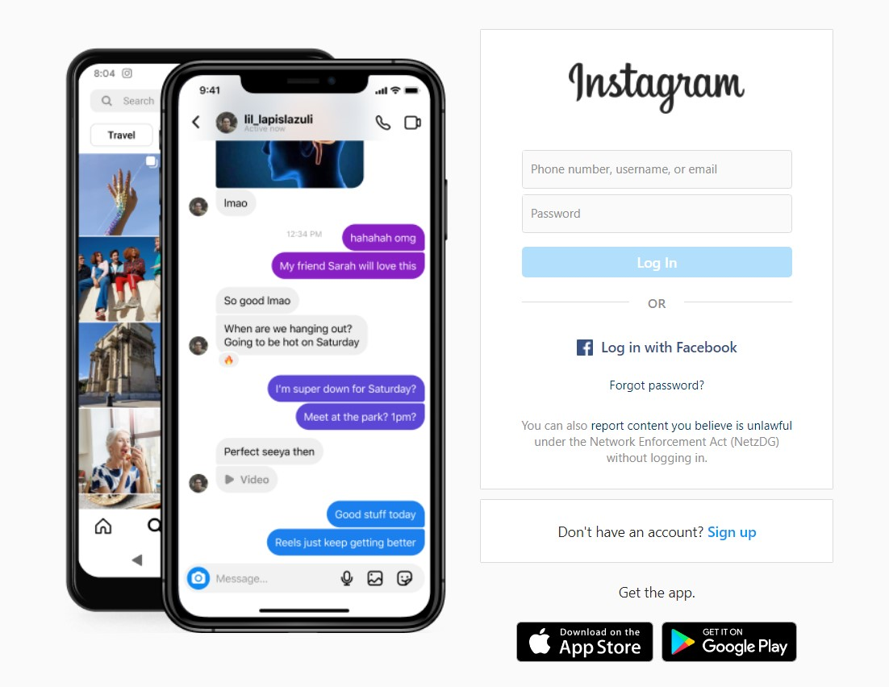
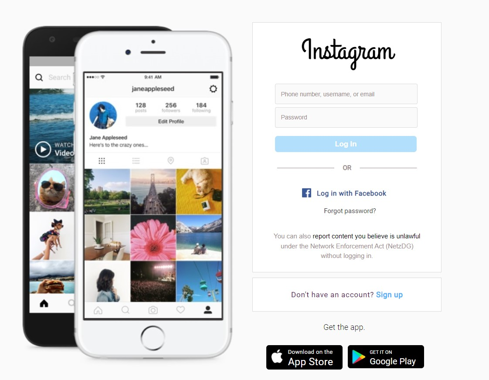

# instagram

## This project is a clone of the instagram login page.

### It was a very fun project to do.

---
## Expectation

---


## Reality

---


### Please keep in mind that

- The dropdown menu in the footer where the user selects the language is not working

- All the links are working but they all belong to instagram, otherwise I would have to create components for all these links

- The animation to the left is not working


## Project setup

```
npm install
```

### Compiles and hot-reloads for development

```
npm run serve
```

### Compiles and minifies for production

```
npm run build
```

### Lints and fixes files

```
npm run lint
```

### Customize configuration

See [Configuration Reference](https://cli.vuejs.org/config/).
